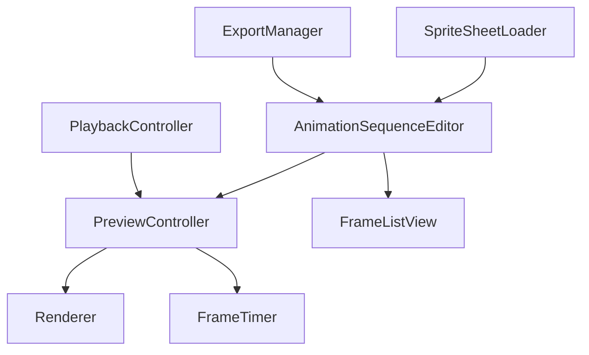

# アニメーションチェックパネル概要設計書

## 1. 設計目的
スプライトシートのフレーム順序編集とアニメーションプレビュー機能を提供するUIパネルの実装

## 2. コンポーネント構成


## 3. 主要クラス設計
| クラス名             | 責務                                                                                                                   |
| -------------------- | ---------------------------------------------------------------------------------------------------------------------- |
| `AnimationSequence`  | フレーム順序とタイミング情報の管理<br>- フレームリストの保持<br>- フレームごとの表示時間設定<br>- シーケンス全体の制御 |
| `SpriteSheetViewer`  | スプライトシートの可視化と選択状態管理<br>- グリッド表示<br>- フレーム選択機能<br>- ズーム制御                         |
| `PreviewController`  | アニメーション再生制御と状態管理<br>- 再生/停止/一時停止<br>- ループ制御<br>- 再生速度調整                             |
| `FrameListView`      | フレームシーケンスのUI表示と編集<br>- ドラッグ＆ドロップ操作<br>- フレーム時間編集<br>- フレーム削除                   |
| `PlaybackController` | 再生制御UIの管理<br>- 再生コントロール表示<br>- タイムライン表示<br>- フレーム移動UI                                   |
| `ExportManager`      | アニメーション設定のエクスポート<br>- シーケンス情報の保存<br>- フォーマット変換                                       |

## 4. データ構造
### 4.1 AnimationSequenceData
```csharp
class AnimationSequenceData
{
    List<FrameData> Frames { get; set; }
    bool IsLooping { get; set; }
    float DefaultFrameTime { get; set; }
    string SequenceName { get; set; }
}

class FrameData
{
    int Index { get; set; }
    Rectangle SourceRect { get; set; }
    float DisplayTime { get; set; }
}
```

## 5. ユーザーインタラクション
1. スプライトシート操作
    - グリッド表示切り替え
    - フレーム選択（単数/複数）
    - ズーム操作

2. シーケンス編集
    - フレームの追加/削除
    - フレーム順序の変更（ドラッグ＆ドロップ）
    - フレーム表示時間の設定

3. プレビュー制御
    - 再生/停止/一時停止
    - ループ設定
    - 再生速度調整
    - フレーム単位移動

4. エクスポート
    - シーケンス設定の保存
    - 異なるフォーマットでの出力

## 6. データフロー
1. DrawableAreaからスプライトシート読み込み
2. フレーム自動検出またはグリッド設定
3. フレーム順序編集（ドラッグ＆ドロップ）
4. フレームごとのパラメータ設定
5. プレビュー用パラメータ設定
6. レンダリング処理
7. フレーム更新制御
8. シーケンス情報のエクスポート

## 7. エラーハンドリング
1. スプライトシート読み込みエラー
    - ファイル未検出
    - フォーマット不正
    - サイズ制限超過

2. フレーム編集エラー
    - 不正なフレーム範囲
    - 重複フレーム
    - フレーム数超過

3. プレビューエラー
    - メモリ不足
    - レンダリングエラー
    - タイミング同期エラー
