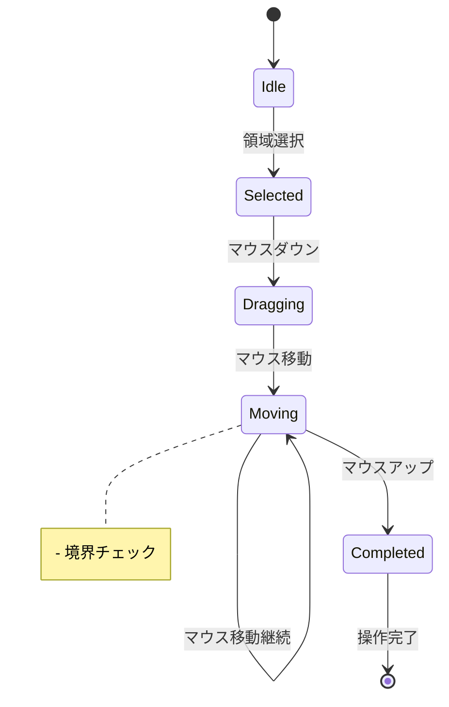

# 選択領域のドラッグ＆ドロップ機能 設計書

## 1. 機能概要

選択された画像領域をドラッグ＆ドロップで移動する機能を実装します。この機能により、ユーザーは選択した領域を直感的に新しい位置に移動できます。

### 1.1 ビジネス要件

- ユーザーは選択した領域の画像を視覚的なフィードバックを得ながら移動できる
- 移動操作はUndo/Redoに対応
- 画像領域の境界を超えた場合の適切な処理

## 2. ユースケース詳細設計

### 2.1 状態遷移とイベント



### 3.2 イベントフロー

1. 選択状態
   - DomainEvent: RegionSelected
   - Validation: 選択領域の境界チェック

2. ドラッグ開始
   - DomainEvent: DragStarted
   - Validation: マウス位置の有効性検証
   - 最適化: 必要最小限の画像データ保存

3. ドラッグ中
   - DomainEvent: DragProgressing
   - パフォーマンス: 描画更新の最適化
   - エラー処理: 境界外への移動制限

4. ドロップ
   - DomainEvent: DragCompleted
   - 指定位置への選択範囲の画像情報の移動
   - トランザクション: 状態の一貫性保持
   - UndoSystem: 操作履歴の最適化
   - リソース解放: 一時データの適切な破棄

## 4. アプリケーション層の実装

```
Eede.Application/UseCase/Drawings/MoveSelectionUseCase.cs
```

### 4.1 インターフェース設計

```csharp
public interface IMoveSelectionUseCase
{
    Task<Result<Unit>> StartDragAsync(Position position);
    Task<Result<Unit>> UpdateDragAsync(Position position);
    Task<Result<Unit>> CompleteDragAsync();
    IObservable<MemoryMetrics> GetMemoryMetrics();
}

public interface ISelectionMoveConfiguration
{
    int MaxSelectionSize { get; }
    TimeSpan UpdateThrottleInterval { get; }
    long MaxMemoryUsage { get; }
}
```

### 4.2 エラーハンドリング

```csharp
public sealed class SelectionMoveException : DomainException
{
    public SelectionMoveCode Code { get; }

    public SelectionMoveException(SelectionMoveCode code, string message)
        : base(message)
    {
        Code = code;
    }
}

public enum SelectionMoveCode
{
    InvalidPosition,
    OutOfBounds,
    InsufficientMemory,
    ConcurrencyError
}
```

## 5. インフラストラクチャ考慮事項

### 5.1 パフォーマンス最適化

- 描画バッファーのメモリプール化
- 遅延評価による不要な中間状態の削減
- バックグラウンド処理の活用
- メモリ使用量の動的最適化

### 5.2 スケーラビリティ

- 将来の機能拡張に備えたインターフェース設計
- プラグイン可能なアーキテクチャ
- メモリ使用量の動的最適化
- パフォーマンスメトリクスの収集

## 6. セキュリティ考慮事項

- 入力値の検証による不正な操作の防止
- リソースの適切な解放
- 大きな画像データの扱いに関する制限
- メモリ使用量の制限と監視

## 7. テスト計画

### 7.1 ユニットテスト

```csharp
[TestFixture]
public class DraggableRegionSelectorTests
{
    [Test]
    public void StartDrag_WithValidPosition_CreatesDragState()
    {
        // Arrange
        var selector = new DraggableRegionSelector();
        var position = new Position(100, 100);

        // Act
        var result = selector.StartDrag(position);

        // Assert
        result.Should().BeSuccess();
        selector.CurrentState.IsDragging.Should().BeTrue();
        selector.CurrentState.StartPosition.Should().Be(position);
    }

    [Test]
    public void StartDrag_WithInvalidPosition_ReturnsError()
    {
        // 境界値テスト
    }

    [Test]
    public void DragUpdate_UnderMemoryPressure_HandlesGracefully()
    {
        // パフォーマンステスト
    }
}
```

### 7.2 統合テスト

- ユースケースレベルのテスト
- エラー条件のテスト
- パフォーマンステスト
- 並行処理テスト

