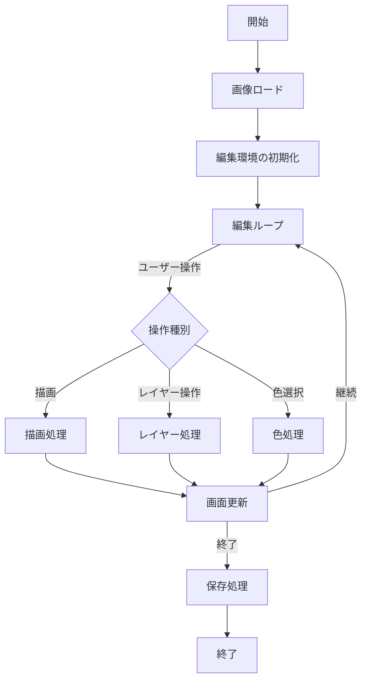
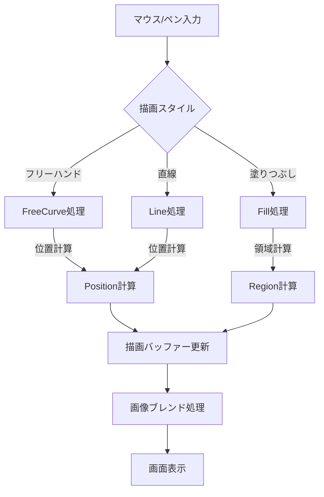
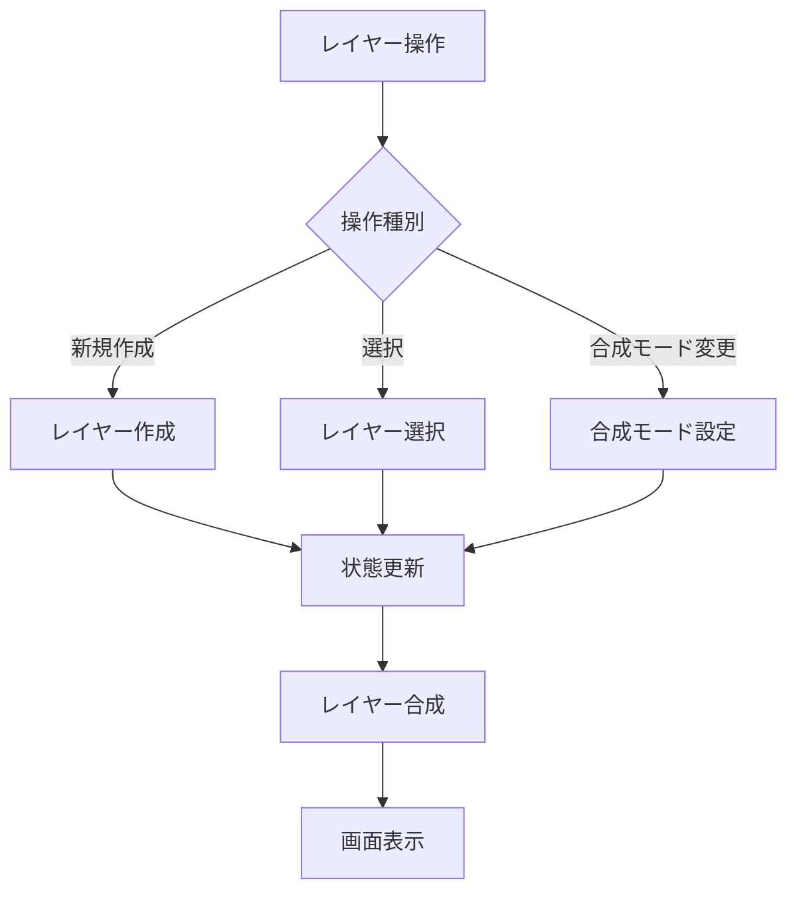
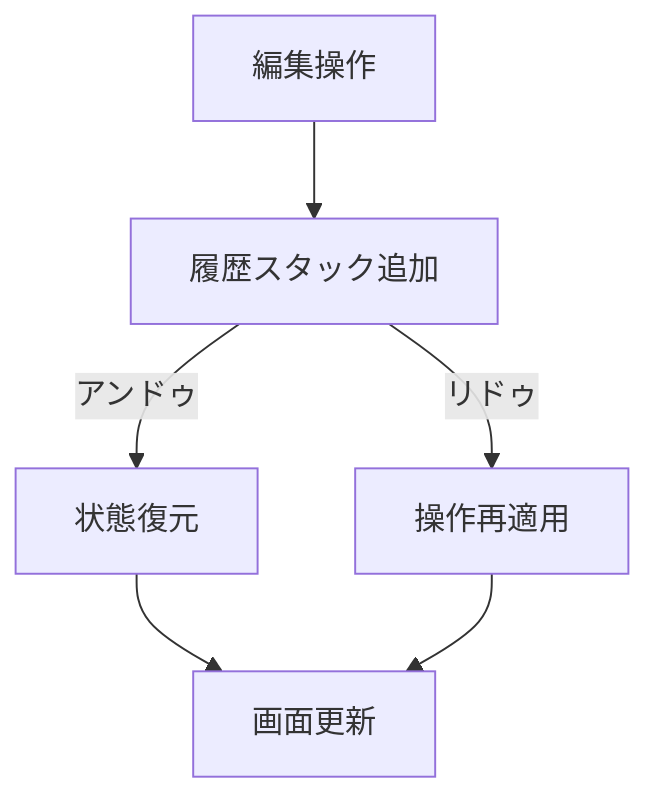
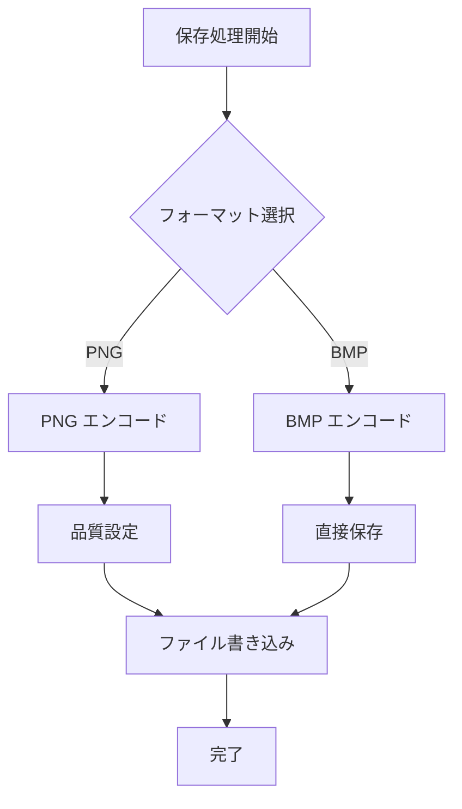
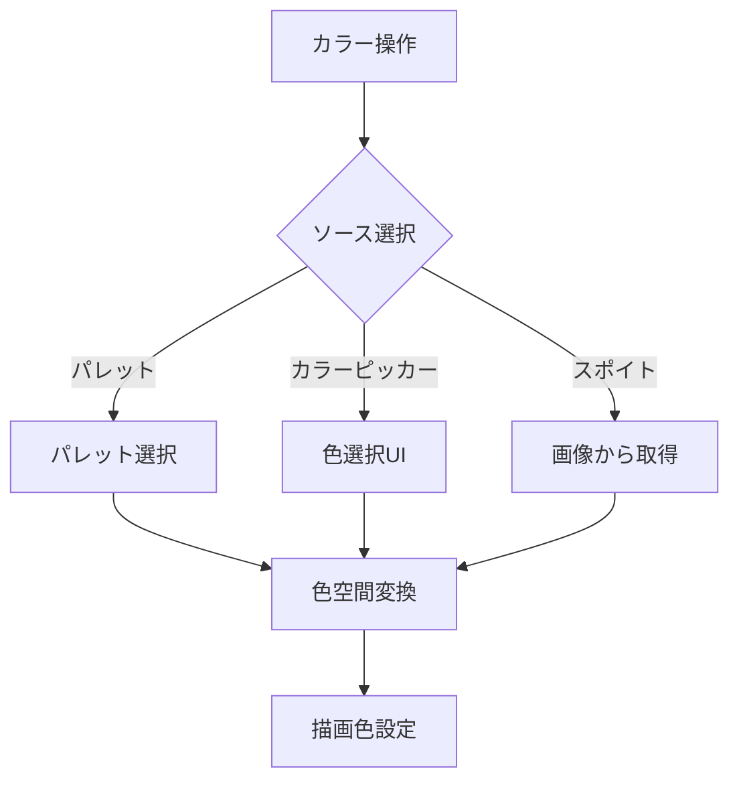
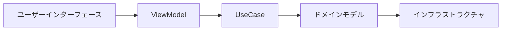
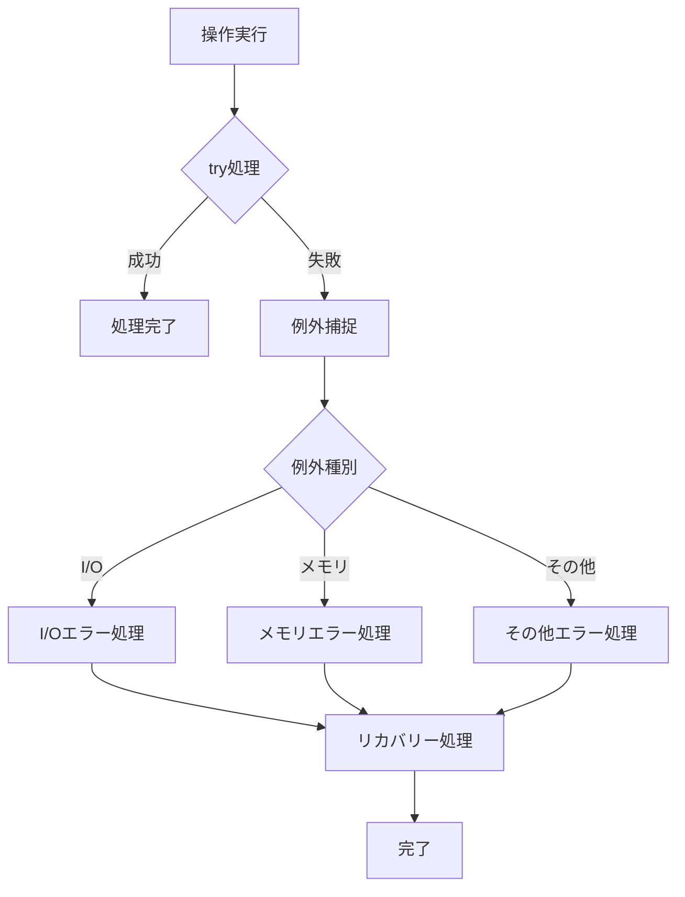
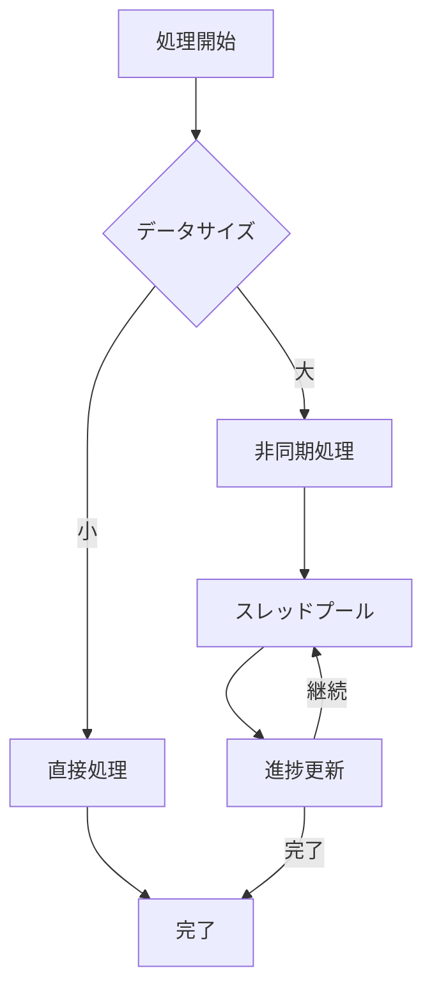

# Eede ビジネスロジックフロー図

## 1. 画像編集の基本フロー

## 2. 描画処理フロー

## 3. レイヤー管理フロー

## 4. アンドゥ/リドゥ処理フロー

## 5. 画像保存フロー

## 6. カラーパレット操作フロー

## 7. データの依存関係

## 8. エラーハンドリングフロー

## 9. パフォーマンス最適化フロー

## 注意事項

1. 各フローは簡略化されており、実際の実装ではより詳細な処理が含まれます。
2. エラーハンドリングはすべてのフローに組み込まれていますが、図の簡略化のため省略されている場合があります。
3. パフォーマンス最適化は、とくに大きな画像を扱う際に重要となります。
4. ユーザー操作に対するレスポンス性を確保するため、重い処理は可能な限り非同期で実行されます。

## 更新履歴

このドキュメントは、新機能の追加や処理フローの変更に応じて更新されます。更新の際は、関連するテストケースの見直しも必要です。
