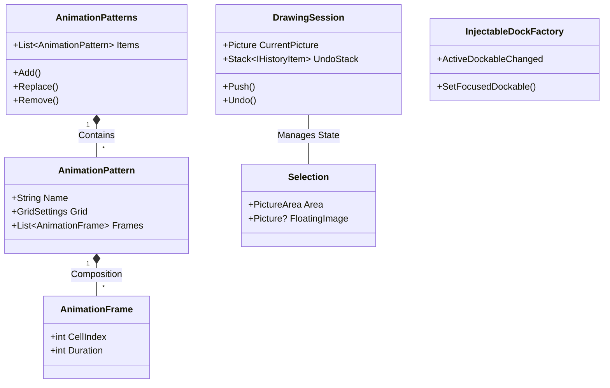

# Domain Analysis: Eede

## 1. Ubiquitous Language (ユビキタス言語)

| 用語 (Term) | 英語名 (English) | 定義 (Definition) | 関連モデル |
| :--- | :--- | :--- | :--- |
| **アニメーションパターン** | AnimationPattern | アニメーションの動き（フレーム順序と時間）を定義する最小単位。画像データは含まない。 | `AnimationPattern`, `AnimationPatterns` |
| **アニメーションフレーム** | AnimationFrame | パターンを構成する個々のコマ。スプライトシート上のインデックスと表示時間を持つ。 | `AnimationFrame` |
| **グリッド設定** | GridSettings | スプライトシートからコマを切り出すためのグリッド情報（サイズ、オフセット）。 | `GridSettings` |
| **作業エリア** | Working Area | 実際にドット絵を描画・編集するメインのキャンバス領域。 | `DrawableCanvasViewModel`, `DrawingSession` |
| **ドックエリア** | Dock Area | 複数の画像をタブ形式で保持したり、ツールを表示したりする分割・移動可能なウィンドウ領域。 | `PictureDock`, `DockControl` |
| **ドキュメント** | PictureDocument | ドックに表示される個々の画像タブ。 | `PictureDocument` |
| **フローティング選択範囲** | Floating Selection | ペースト直後などの、背景画像と結合されずに移動可能な状態にある選択範囲。 | `Selection`, `PasteFromClipboardUseCase` |
| **描画セッション** | DrawingSession | 一連の描画操作の履歴を管理する単位。Undo/Redo の基盤。 | `DrawingSession`, `HistoryManager` |
| **注入可能ドックファクトリ** | InjectableDockFactory | DI コンテナと連携し、ViewModel を自動解決してドックを生成するファクトリ。 | `InjectableDockFactory` |

## 2. Domain Model & Relationships

## 3. Strategic Design (戦略的設計)

### Subdomain Classification

*   **Core Domain (コアドメイン)**: `ImageEditing`, `Animation`
    *   **Reasoning**: ドット絵エディタとしての核心的価値を提供する領域。ピクセル操作、選択範囲の制御、およびスプライトアニメーションのプレビュー機能は、Eede の競争力を決定づける要素であり、最も複雑なビジネスロジックを含む。
    *   **Key Aggregates**: `Picture`, `DrawingSession`, `AnimationPatterns`

*   **Supporting Subdomain (支援サブドメイン)**: `Settings`, `Infrastructure`
    *   **Reasoning**: アプリケーションの動作を支える重要な機能だが、それ自体がビジネスの主要な差別化要因ではない。DI コンテナの統合やテーマ設定などが該当する。
    *   **Key Aggregates**: `GlobalState`, `InjectableDockFactory`

*   **Generic Subdomain (汎用サブドメイン)**: `Docking`
    *   **Reasoning**: ウィンドウ配置やタブ管理は、既存のライブラリ（Dock.Avalonia）を利用して解決されている一般的な問題領域。
    *   **Key Aggregates**: `RootDock`, `DocumentDock`

## 4. Context Map & Integration
- **Docking Context** と **ImageEditing Context** は、`InjectableDockFactory` および `MainViewModel` を介して連携している。
- 特に「フォーカス同期」においては、Docking 側の汎用的なイベントを、Application 層が独自のロジック（再帰防止ガード）でフィルタリングし、Core Domain の状態（ActivePicture）へ変換している。
